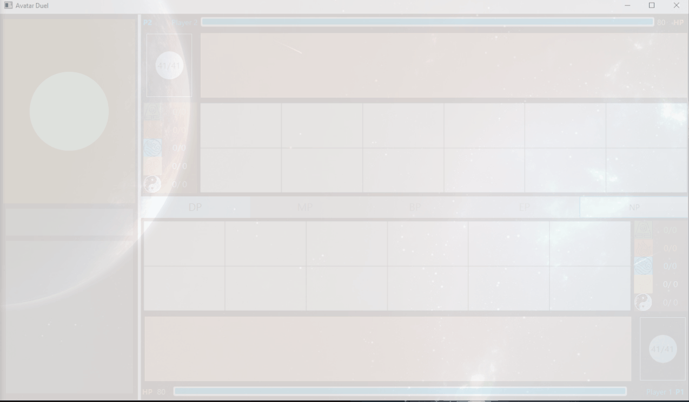
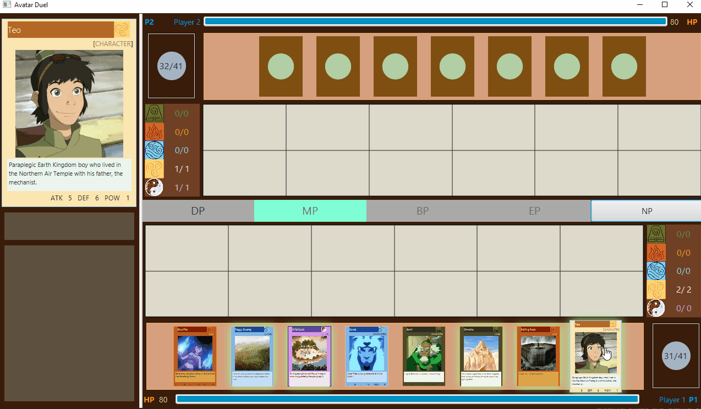
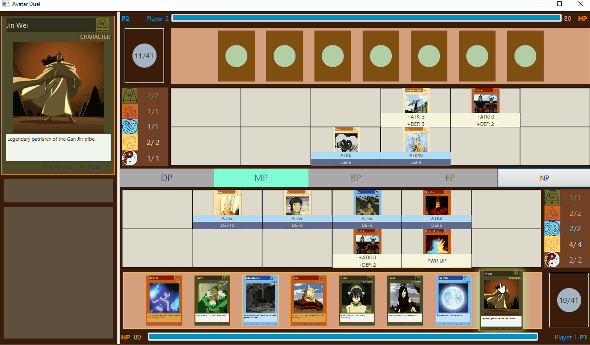
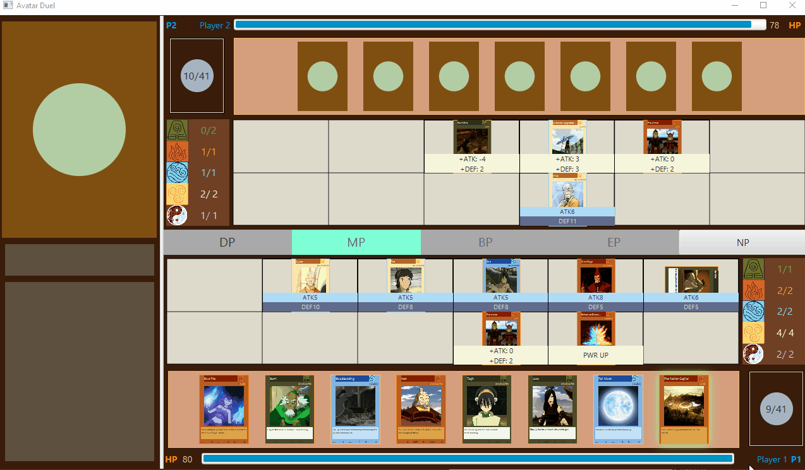

# Avatar Duel
Card game sederhana yang memanfaatkan konsep OOP dalam implementasinya.
Proyek ini merupakan tugas besar 2 mata kuliah IF2210-Pemrograman Berorientasi Objek 2019/2020.

## Gameplay

### Aturan
* Permainan dimainkan oleh dua orang secara bergantian yang terdiri atas Draw phase, Main Phase, Battle Phase, dan End Phase.
* Setiap pemain akan diberikan deck kartu dan memiliki 80 HP.
* Kartu yang diberikan dapat terdiri atas kartu karakter, kartu land, dan kartu skill. Tiap kartu bisa merupakan satu dari 5 elemen yang ada yaitu earth, air,water, fire, energy.
* Pada awal game, tiap pemain mengambil 7 kartu dari deck ketangan.
* Aturan dan spesifikasi lebih lengkap dapat dilihat di spesifikasi tugas

### Draw Phase
* Pada Draw phase, pemain akan mendapatkan satu kartu dari deck milik pemain tersebut ke tangan
* Jika banyak kartu di tangan adalah 7, maka kartu tetap akan ditambahkan ke tangan


### Main Phase
* Saat Main Phase, pemain dapat meletakan beberapa kartu karakter dalam posisi bertarung atau bertahan, mengubah posisi kartu di field, meletakan maksimal 1 kartu land, meletakkan kartu skill serta karakter yang dikenai skill tersebut, dan membuang kartu skill
* Kartu dapat diletakkan dengan melakukkan drag and drop ke field
* Kartu karakter dapat diubah posisinya dengan menekan kartu tersebut
* Kartu skill di field dapat dibuang pada fase ini dengan melakukan double click pada kartu tersebut 


### Battle Phase
* Pemain dapat menggunakan karakter untuk menyerang lawan, penyerangan langsung hanya dapat dilakukan jika tidak ada kartu karakter di field lawan
* Setiap kartu hanya bisa menyerang satu kali dalem phase ini


### End Phase
* Pemain mengakhiri giliran pada phase ini. Lawan akan memulai giliran-nya, dimulai dari draw phase, dan seterusnya.
* Perlu diingat ketika endphase bisa jadi kartu ditangan penuh sehingga perlu membuang salah satu kartu. Untuk membuang salah satu kartu dapat dilakukan dengan melakukan double click pada kartu tersebut


## Prerequisites

Berikut adalah keperluan untuk menjalankan game ini
* Java 8
* Gradle

## Running

Untuk menjalankan permainan, jalankan perintah berikut
```
gradlew run
```

## Unit Testing

Berikut adalah modul yang dites
* Deck
* Dealer
* Player
* Game
Tes dilakukan dengan JUnit serta Mockito dan dapat dijalankan dengan perintah berikut
```
gradlew clean test
```


## Documentation
Dokumentasi dapat diakses di build/docs/javadoc/index.html, dokumentasi ini dibuat menggunakan javadoc.

## Project Structure
Berikut adalah struktur folder dari kode program
```
src
├───main
│   ├───java
│   │   └───com
│   │       └───avatarduel
│   │           ├───controller
│   │           ├───event
│   │           ├───model
│   │           │   └───card
│   │           └───util
│   └───resources
│       └───com
│           └───avatarduel
│               ├───card
│               │   ├───data
│               │   └───image
│               │       ├───character
│               │       ├───element
│               │       ├───land
│               │       ├───power
│               │       └───skill
│               ├───sfx
│               ├───video
│               └───view
└───test
    └───java
```

## Built With

* [Java](https://www.java.com/en/) - Bahasa pemrograman
* [Gradle](https://gradle.org/) - Build tool
* [JUnit](https://junit.org/junit5/) - Unit testing framework
* [Mockito](https://site.mockito.org/) - Mocking framework for unit test

## Authors
* **Arung Agamani Budi Putera** - *13518005*
* **Faris Fadhilah** - *13518026*
* **Faris Rizki Ekananda** - *13518125*
* **Michel Fang** - *13518137*
* **Yasyfiana Fariha Putrisusari** - *13518143*


## Acknowledgments

* Dosen IF2210 K2, Muhammad Zuhri Catur Candra, ST., MT
* Asisten Pembimbing, Antonio Setya

## Notes
Fitur-fitur dasar dan tambahan tidak terlepas dari bug, terutama fitur-fitur yang merupakan spesifikasi *bonus*, oleh karena itu kami minta maaf atas ketidaksempurnaan program.

## Credit
All card images and description are taken from [Avatar Wikia](https://avatar.fandom.com/wiki/Avatar_Wiki)